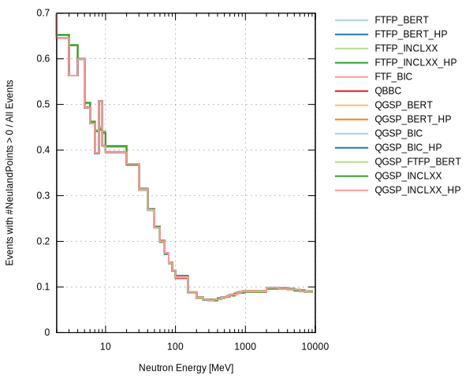
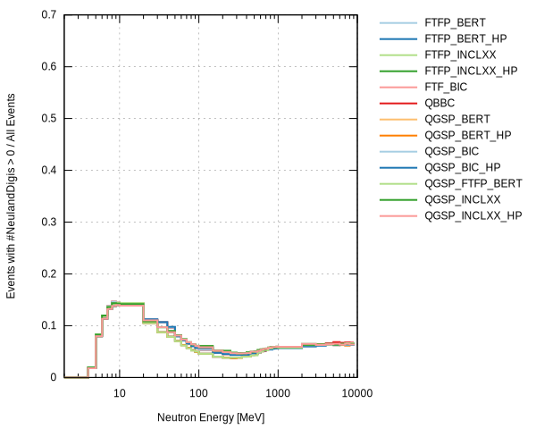

# Neutron Cross Section

Tests the interaction of neutrons in a single NeuLAND paddle for different energies and physics lists.


## Requirements

Iterating over physics lists requires `g4Config.C` to respond to environment variables, e.g.:

```C++
TString physicsList = gSystem->Getenv("PHYSICSLIST");
if (physicsList == "")
{
    physicsList = "QGSP_BIC_HP";
}

TG4RunConfiguration* runConfiguration =
    new TG4RunConfiguration("geomRoot", physicsList, "stepLimiter+specialCuts");
TGeant4* geant4 = new TGeant4("TGeant4", "The Geant4 Monte Carlo", runConfiguration);
````

Also see the ["CleanHouse" commit on github](https://github.com/janmayer/R3BRoot/commit/91ce606717e5a4d043f5346fe46bd0ded6684b53).


## Executing

1. Step1_Simulate.sh
2. Step2_Digitizing.sh
3. eval.sh
4. plot.gp


## Example Results



The ratio of events with energy deposition in the active material to all events is basically proportional to the total cross section σ(n tot). All physics lists show basically identical results, as expected.



With the detector response, small differences between the physics lists can be observed, which hint at different energy deposition behavior.
