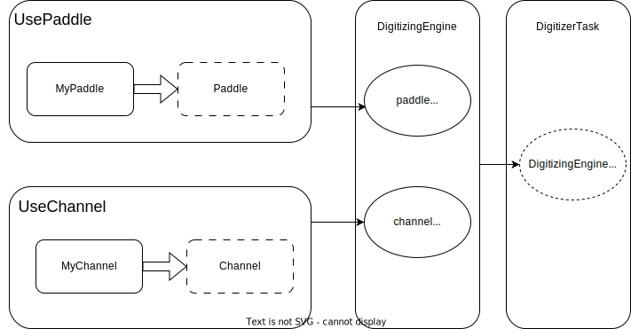

# Neuland Digitizing

Digitizing is the process of converting the "raw" Monte Carlo energy depositions to experimental look-alike hits.

## Overview

The Digitizing task `R3BNeulandDigitizer` handles the Input and Output of data. The task takes the `R3BNeulandPoints` from the Simulation, runs them through a `DigitizingEngine` and fills `R3BNeulandHits`. It also requires the configuration storage `NeulandGeoPar` to convert position coordinates.

## Examples for users
It's encouraged to create an executable file to use this digitization task. However, users are still able to use the task in ROOT Macro file, with much less configurability though.

### Using a ROOT Macro file
For the ROOT Macro file, the input parameter of the digitization task can only be one of the two options: `neulandTamex` and `neulandTacquila`.  
Example:
```cpp
    FairRunAna run;
    run.AddTask(new R3BNeulandDigitizer(R3BNeulandDigitizer::Options::neulandTamex));

    // or with Tacquila digitizer:
    // run.AddTask(new R3BNeulandDigitizer(R3BNeulandDigitizer::Options::neulandTacquila));
```

### Using a C++ executable
Much more options are available when the task is used in a C++ executable. Such an example can be found in the source file [neulandAna.cxx](../executbales/neulandAna.cxx) implemented with some program options. To see what kind of options can be used with this executable, go to the folder `build/bin` and run the executable with:
```shell
./neulandAna -h
```
Before running any executable, please make sure the configuration file `build/config.sh` has been sourced.

#### How to create an engine for the task
The digitization task must be set with a digitization engine, which specifies the type of the scintillator and the digitization channel.

An engine can be created with
```cpp
namespace Digitizing = R3B::Digitizing;
using NeulandPaddle = Digitizing::Neuland::NeulandPaddle;
using TamexChannel = Digitizing::Neuland::Tamex::Channel;
using Digitizing::UseChannel;
using Digitizing::UsePaddle;

auto engine = Digitizing::CreateEngine(UsePaddle<NeulandPaddle>(), UseChannel<TamexChannel>());
```
which chooses the Neuland scintillator and the Tamex channel for the digitization engine. Then, the task can be setup with this engine by
```cpp
auto run = std::make_unique<FairRunAna>();
auto digiNeuland = std::make_unique<R3BNeulandDigitizer>();
digiNeuland->SetEngine(std::move(engine));

// add the task to the FairRun
run->AddTask(digiNeuland.release());
```

#### Setup the parameter for channels
The Tamex channel has an option to setup its parameters through an object in the type `R3B::Digitizing::Neuland::Tamex::Params`:
```cpp
namespace Tamex = Digitizing::Neuland::Tamex;
using TamexChannel = Digitizing::Neuland::Tamex::Channel;
auto tamexParameter = Tamex::Params{ TamexChannel::GetDefaultRandomGen() };
tamexParameter.fPMTThresh = 1.;
tamexParameter.fTimeMin = 1.;

auto engine = Digitizing::CreateEngine(UsePaddle<NeulandPaddle>(), UseChannel<TamexChannel>(tamexParameter));
```

Following table shows all the parameters that can be modified for the Tamex channel:
| Name                                      | Type   | Default value | Meaning                                                |
|-------------------------------------------|--------|---------------|--------------------------------------------------------|
| fPMTThresh                                | double | 1. [MeV]      | Value of the PMT threshold                             |
| fSaturationCoefficient                    | double | 0.012         | Saturation coefficient of PMTs                         |
| fExperimentalDataIsCorrectedForSaturation | bool   | true          | If true, the PMT saturation effect is enabled          |
| fTimeRes                                  | double | 0.15 [ns]     | Time resolution of channel outputs                     |
| fEResRel                                  | double | 0.05 [MeV]    | Energy resolution of channel outputs                   |
| fEnergyGain                               | double | 15.0          | Value of the PMT gain (used for the width calculation) |
| fPedestal                                 | double | 14.0          | Pedestal value (used for the width calculation)        |
| fTimeMax                                  | double | 1000. [ns]    | Maximum time cutoff                                    |
| fTimeMin                                  | double | 1. [ns]       | Minimum time cutoff                                    |
| fQdcMin                                   | double | 0.67 [MeV]    | Minimum energy cutoff                                  |

On the other hand, users are also allowed to set the parameters of each channel according to a parameter container from the calibration process:
```cpp
auto fileio = std::make_unique<FairParRootFileIo>();
fileio->open("params_sync.root");
run->GetRuntimeDb()->setFirstInput(fileio.release());

using TamexChannel = Digitizing::Neuland::Tamex::Channel;
auto const channelInit = []() { TamexChannel::GetHitPar("NeulandHitPar"); };
auto engine = Digitizing::CreateEngine(UsePaddle<NeulandPaddle>(), UseChannel<TamexChannel>(), channelInit);
```
In the example above, the object with the name "NeulandHitPar" should have the type `R3BNeulandHitPar` in the root file "params_sync.root".

## DigitizingEngine
A `DigitizingEngine` object handles the actual data processing, which requires another two objects as the input parameters for its instantiation: `UseChannel` and `UsePaddle`. As suggested by their names, these two objects behave like factories, which are used by `DigitizingEngine` to generate `Channel` and `Paddle` objects. 

### Interface design
To minimize the coupling between different algorithm components, users should use the base class of `DigitizingEngine` (`DigitizingEngineInterface`) containing all necessary essential interfaces. The following diagram depicts the correct usage of this class:


An example of the digitizer class:
```cpp
class MyDigitizer
{
    public:
        MyDigitizer() = default;
        SetDigiEngine(DigitizingEngineInterface* engine){
            engine_ = engine;
        }
    private:
        DigitizingEngineInterface* engine_ = nullptr;
};

class MyDigitizingEngine : public DigitizingEngineInterface
{
    //...
};

int main(){
    MyDigitizingEngine* myEngine = Make_engine<MyDigitizingEngine>();
    auto myDigi = MyDigitizer();
    myDigi.SetDigiEngine(std::move(myEngine));
}
```
Here instead of letting the class member `engine_` directly have the type `MyDigitizingEngine`, let its type be the base class `DigitizingEngineInterface`. Such a design pattern has two major advantages:

- Dependency injection

    The class `MyDigitizer` is no longer bundled together with `MyDigitizingEngine`. The dynamic type of its member variable `Engine_` can be any type with various implementations.
    
- Compilation wall

    Implementation details are hidden from `MyDigitizer`. Therefore, any changes made in `MyDigitizingEngine` will not cause the recompilation of the class `MyDigitizer`.

### Instantiation
As a class template, `DigitizingEngine` has the following structure:
```cpp
template <typename PaddleClass, typename ChannelClass, typename InitFunc = std::function<void()>>
class DigitizingEngine : public DigitizingEngineInterface
{
  public:
    DigitizingEngine(
        const UsePaddle<PaddleClass>& p_paddleClass,
        const UseChannel<ChannelClass>& p_channelClass,
        InitFunc initFunc = []() {})
        : paddleClass_{ p_paddleClass }
        , channelClass_{ p_channelClass }
        , DigitizingEngineInterface()
        , initFunc_{ initFunc }
    {
    }
```
Therefore, an instantiation directly with this constructor is a little bit complicated:
```c++
using Digitizing::DigitizingEngine;
auto myEngine = std::make_unique<DigitizingEngine<MyPaddle, MyChannel>>(UsePaddle<MyPaddle>{}, UseChannel<MyChannel>{});
```
However there is a helper function template called `CreateEngine` that can be used to instantiate this class more easily:
```c++
using Digitizing::CreateEngine;
using Digitizing::UsePaddle;
using Digitizing::UseChannel;
auto myEngine = CreateEngine(UsePaddle<MyPaddle>{}, UseChannel<MyChannel>{});
```

### InitFunc
There is a third optional parameter of the constructor of the class template `DigitizingEngine` called `InitFunc`. It takes a `std::function` or a lambda function as an input, which will be invoked inside the member function `DigitizingEngine::Init()`. The existence of such a parameter introduces another dependency injection of any kind of initialization function needed for the paddle or channel classes, such as the parameter initialization before the event loop. One example could be:
```c++
auto const channelInit = [&]() { MyChannel::GetHitPar("ParName"); };
auto myEngine = Digitizing::CreateEngine(UsePaddle<MyPaddle>{}, UseChannel<MyChannel>{}, channelInit);
```

### UsePaddle and UseChannel
The `UsePaddle` and `UseChannel` class template are two input parameter types of the class template `DigitizingEngine`. They specify the paddle and channel class (containing all implementations of the real physical paddle and channel) and the input parameters of the corresponding class constructors.

For example, if the paddle and channel class are defined in the following way:

```c++
#include "DigitizingChannel.h"
#include "DigitizingPaddle.h"

class MyChannel : public Digitizing::Channel
{
    public:
        MyChannel(ChannelSide channelSide, int channelPar1, double channelPar2) 
        : Digitizing::Channel(side)
        {
            //...
        }
};

class MyPaddle : public Digitizing::Paddle
{
    public:
        MyPaddle(uint16_t paddleID, int paddlePar1) 
        : Digitizing::Paddle(paddleID)
        {
            //...
        }
};
```
then `UsePaddle` and `UseChannel` should be defined as:
```c++
//...
// auto paddlePar1 = ...
auto paddle = UsePaddle<MyPaddle>{paddlePar1};

// auto channelPar1 = ...
// auto channelPar2 = ...
auto channel = UseChannel<MyChannel>(channelPar1, channelPar2);
```
Remember that only additional input parameters should be given in the curly brackets. The parameters, such as `channelSide` or `paddleId`, already required in the base class `Digitizing::Channel` and `Digitizing::Paddle` should not be given as input parameters to `UsePaddle` and `UseChannel`.

### Relations inside the framework



## Nomenclature
The input and the output of the paddle and channel class are represented by four different I/O structures (in the namespace of `Digitizing`).

| Struct name | Meaning| Member variables|
|------|--------|-----------------|
|`PaddleSignal`| Output of paddle class <br> passed to the output of digitizingEngine<br> (reconstructed hit level data) | `double energy` (in _`MeV`_) <br> `double time` (in _`ns`_) <br> `double position` (in _`cm`_) <br> `const Channel::Signal& leftChannel` <br> `const Channel::Signal& rightChannel`|
|`ChannelSignal`| Output of channel class <br> passed to the paddle class as an input |`double qdc`(in _`MeV`_) <br>`double tdc` (in _`ns`_)<br>`double qdcUnSat`(unsaturated QDC value) <br> `ChannelSide side` (left or right)|
|`PaddleHit`| Input of the paddle class from <br> the input of digitizingEngine | `double time`(in _`ns`_) <br> `double LightDep` (in _`MeV`_) <br> `double DistToPaddleCenter` (in _`cm`_) |
| `ChannelHit`| Input of the channel from the input <br> of the paddle class | `double time` (in _`ns`_) <br> `double light`(in _`MeV`_) |

## Paddle class
The paddle class should include all algorithms needed to simulate the real process in the paddle shaped scintillators, such as the light attenuation and reconstruction of the energy deposition from the signals of two channels on either end. All paddle classes, used by `UsePaddle`, have to be child classes of the `Digitizing::Paddle` base class. A simple example of such a paddle class can be found in the class [DigitizingPaddleMock](DigitizingPaddleMock.h).

There are two components that must be defined in the derived paddle classes:
1. How to generate the channel hits which are the inputs of the two channels?
2. How to generate the paddle signal from the output of the two channels (channel signals)?

For these two requirements, there are several pure virtual functions from the class `Digitizing::Paddle` that must be overridden in the child classes:

### ComputeChannelHits
This function is used to calculate the hits of both channels from a paddle hit. The signature is defined as follows:
```c++
virtual auto ComputeChannelHits(const Paddle::Hit& hit) const -> Pair<Channel::Hit> = 0;
```
Any real physical processes related to the scintillators, such as light attenuation, could be introduced in this function.

### ComputeTime
This function is used to calculate the time of the reconstructed paddle signal from the two channel signals. Its signature is defined as follows:
```c++
virtual auto ComputeTime(const Channel::Signal& firstSignal, const Channel::Signal& secondSignal) const
    -> double = 0;
```
Here the sides of the first and second channel signals don't matter as long as two channel signals come from different sides. The output of this function is the `double` type.

### ComputeEnergy
This function is used to calculate the energy of the paddle signal from two channel signals. Its signature is defined as:
```c++
virtual auto ComputeEnergy(const Channel::Signal& firstSignal, const Channel::Signal& secondSignal) const
    -> double = 0;
```
with the input parameter as channel signals coming from different sides.

### ComputePosition
This is used to compute the position of the paddle signal with the following signature:
```c++
virtual auto ComputePosition(const Channel::Signal& rightSignal, const Channel::Signal& leftSignal) const
    -> double = 0;
```
Since there is a positive direction the position, the first input parameter must be the channel signal coming from the right (top) side and the second parameter must be the one coming from the left (bottom) side.

### Constructor
The constructor of the derived paddle class must have the paddle ID as the first parameter.

## Channel class
Channel class is responsible for the simulation of physical processes in the digitization channels, such as the pileup effect, PMT saturation or low energy filtering. The input and output of the channel classes are directly connected to the corresponding paddle class. Just as for the paddle class, every channel class used by `UseChannel` must be derived from the base class of `Digitizing::Channel`, which has three pure virtual functions that must be overridden (see [DigitizingChannelMock](DigitizingChannelMock.h) for a simple example.):

### AddHit
This is the input function of the channel class with the parameter to be of the type `Channel::Hit` and the signature as follows:
```c++
virtual void AddHit(Channel::Hit hit) = 0;
```
It's called every time an input hit is fed into the digitizingEngine, without any threshold. The input parameter is the return value of the paddle member function `ComputeTime`. In almost all cases, the derived channel class should have a private member variable to store useful input hits for later data processing (such as applying a threshold or pileup effects).


### ConstructSignals
This function calculates the output from the channel class (`Channel::Signals`) to the paddle class. Its function signature is defined as follows:
```c++
virtual auto ConstructSignals() -> Channel::Signals = 0;
```
The return value should be calculated from the hit collections obtained by the input member function `AddHit`. It will then be fed into the paddle object as an input parameter of multiple paddle member functions.

### Constructor
The constructor of the derived channel class **must** have the channel side as the first input parameter.
