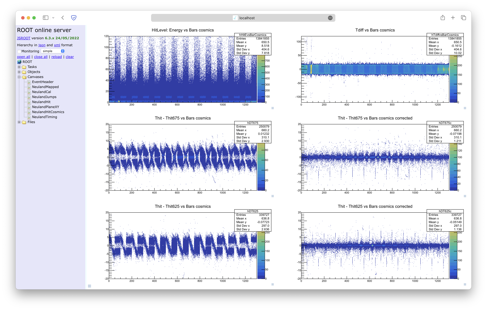

# NeuLAND online analysis
The NeuLAND online analysis focuses on data visualization of different levels of NeuLAND data converted from the list mode data with existing calibration parameters. The analysis can be done either during the beam time, when the raw data comes from a socket (pipe) or after the beam time, when the raw data is stored in list mode files (file stream). The NeuLAND calibration parameters can be calculated from the cosmic data using [multiple calibration algorithms](../calibration/readme.md). Both NeuLAND and LOS calibration parameters are required in this analysis and must be put in a single root file using a program called `neuland_par_merger`. The output of the analysis are histograms of different NeuLAND data levels and can be checked concurrently through a web browser in the local machine.

## Running online analysis
Before running the program, please make sure R3BRoot is compiled successfully and the `config.sh` is correctly sourced in the R3BRoot build folder:
```shell
${R3BRoot}/build.py -a
source ${R3BRoot}/build/config.sh
```
The online analysis program is called `neuland_online_monitor` and its flags can be checked with the command:
```shell
neuland_online_monitor -h
```
Here is the output:
```text
Online monitor for neuland data:
  -i [ --inStream ] arg set the input data stream
  --par arg             set the path of the parameter file (only one allowed)
  -h [ --help ]         help message [ = false]
  --no-trig             NeuLAND trigger times are disabled [ = false]
  -v [ --logLevel ] arg set log level of fairlog [ = "info"]
  -n [ --eventNum ] arg set the event number [ = 1000]
  -r [ --runID ] arg    set the input runID [ = 999]
  --dp arg              set the number of double planes for neuland [ = 13]
  --wrID arg            set the white rabbit id [ = "0x1000U"]
  --unpack arg          set the path of unpacker executable relative to
                        ${UCESB_DIR}/../unexps/ [ = "202205_s509/202205_s509"]
  -p [ --port ] arg     set the port number of the output https server [ =
                        11000]
```

_Additional info about the flags above:_

* `-n`: If the value is less than or equal to 0, the program will run through all events available.
* `-i`: Use [regex](https://en.wikipedia.org/wiki/Regular_expression) to specify multiple input lmd files.
* `-p`: The port number must not be preoccupied.

If more functionalities are required, please edit the source file `neuland_online_monitor.cxx` accordingly and create a pull request for the new features, or directly contact developers in NeuLAND WG.

### Example 1: Using a file stream
```shell
neuland_online_monitor --par "/lustre/r3b/ywang/test/test_online/test.root" -i "/lustre/r3b/202205_s509/lmd/main0159.*.lmd" -v info -r 159 -n 0 -p 10000
```
If the program is run in the local machine, to check the histograms from the program, simply open a web browser and visit the link [http://localhost:10000](http://localhost:10000).

If the program is run in a server (e.g. lxir136), before visiting the link, a ssh tunnel has to be created with:
```shell
ssh -L 10000:localhost:10000 user_name@lxir136 -N
```

> [!Important]
> The first number in `10000:localhost:10000` must be the same as the number in the link used in browser. The second number must be the same as the port number used by `neuland_online_monitor`. Sometimes this port number could be already occupied and the user must choose a different value (see [this page](https://en.wikipedia.org/wiki/Registered_port#:~:text=Ports%20with%20numbers%200–1023,dynamic%2C%20private%20or%20ephemeral%20ports.) to know which values should be chosen).

### Example 2: Using a socket
_to be tested_

## Parameter merge
To merge parameters of different detectors and put them into a single file, one example can be shown below:
```shell
neuland_par_merger --par-in="neuland_par.root;loscalpar_v1.root" --par-out="test2.root"
```
The meaning of flags can also be seen with the command:
```shell
neuland_par_merger -h
```
Here is the output:
```text
Parameter merge:
  -h [ --help ]         help message [ = false]
  -v [ --logLevel ] arg set log level of fairlog [ = "info"]
  --par-out arg         set the path of the parameter file to merge into (only
                        one allowed)
  --par-in arg          set the path of the parameter files to merge from
                        (semicolon seperated)
```
`--par-in` flag specifies all file names of input parameters, separated by semicolons. Many important information, such as run ID and version numbers are only determined by the first file name.

## How to create new histograms (for developers)

The NeuLAND online analysis outputs histograms grouped by different canvases. The related `FairTask` is the class named [R3BNeulandOnlineSpetra2](R3BNeulandOnlineSpectra2.h). The usage of this class can be seen in the source code [neuland_online_monitor.cxx](../executables/templates/neuland_online_monitor.cxx):
```cpp
auto online_spectra = std::make_unique<R3B::Neuland::OnlineSpectra>();
online_spectra->SetRandomGenerator(&random_gen);
online_spectra->AddCanvas<R3B::Neuland::EventHeaderCanvas>("EventHeader");
online_spectra->AddCanvas<R3B::Neuland::MappedCanvas>("NeulandMapped");
online_spectra->AddCanvas<R3B::Neuland::CalCanvas>("NeulandCal", R3B::Neuland::CalTrigger::allspill);
online_spectra->AddCanvas<R3B::Neuland::TJumpCanvas>("NeulandJumps");
online_spectra->AddCanvas<R3B::Neuland::HitCanvas>("NeulandHit", R3B::Neuland::CalTrigger::onspill);
online_spectra->AddCanvas<R3B::Neuland::HitXYCanvas>("NeulandPlaneXY", R3B::Neuland::CalTrigger::onspill);
online_spectra->AddCanvas<R3B::Neuland::HitCosmicCanvas>("NeulandHitCosmics", R3B::Neuland::CalTrigger::offspill);
online_spectra->AddCanvas<R3B::Neuland::TimingCanvas>("NeulandTiming", R3B::Neuland::CalTrigger::onspill);
run.AddTask(online_spectra.release());
```
Here canvases are added one by one with the corresponding names and trigger conditions. If the trigger condition is not specified, the default one, `R3B::Neuland::CalTrigger::all`, will be chosen. Triggers are defined in the source file [R3BNeulandTriggerTypes.h](../calibration/share/R3BNeulandTriggerTypes.h) with following available options (all in the namespace `R3B::Neuland::CalTrigger`):

* onspill: the 1st bit of TPAT is set
* offspill: the 14th bit of TPAT is set
* allspill: onspill or offspill
* all: accept everything

### Canvas class
A canvas holds a set of histograms or graphs which are plotted with some data according to a certain trigger condition. To create a new canvas and add it to the online spectra class, user need to define a class derived from a bass class called `R3BNeulandOnlineCanvas`. Many examples can be found in the folder [canvases](./canvases). Here is another simple example:

```cpp
#pragma once

#include "R3BNeulandOnlineCanvas.h"
#include <R3BIOConnector.h>
#include <R3BNeulandHit.h>

namespace R3B::Neuland
{
    class ExampleCanvas : public OnlineCanvas
    {
      public:
        explicit ExampleCanvas(std::string_view name)
            : OnlineCanvas(name)
        {
        }

      private:
        InputVectorConnector<R3BNeulandHit> hit_data_{ "NeulandHits" };
        CanvasElement<TH2D> histogram_;

        void DataInit() override { hit_data_.init(); }
        void CanvasInit(DataMonitor& histograms) override { ... }
        void CanvasFill(DataMonitor& histograms) override { ... }
        void CanvasFinish() override {}
    };
} // namespace R3B::Neuland
```
An canvas class contains 4 important virtual methods to be overriden:
* DataInit(): contains initialization of input data.
* CanvasInit(): contains definitions of histograms.
* CanvasFill(): fill the input data to each histograms.
* CanvasFinish(): contains actions when each event is finished.

The base class `R3BNeulandOnlineCanvas` also contains a pointer to the online spectra, from which the event header and other parameters can be obtained as well.

### CanvasElement class
The `CanvasElement` class holds any graph-like object, such as histograms (`TH1`) or graphs (`TGraph`). To add the elements to the canvas, first a `TCanvas` class need to be specified in the `CanvasInit()` method:
```cpp
void ExampleCanvas::CanvasInit(DataMonitor& histograms)
{
    auto& canvas = CreateNewCanvas(histograms);
    canvas.divide(2, 2);
}
```
Here the canvas is divided into 2 by 2 pads, each of which holds a canvas element. To specify the element with the corresponding pad, it can be done with:
```cpp
void ExampleCanvas::CanvasInit(DataMonitor& histograms)
{
    auto& canvas = CreateNewCanvas(histograms);
    canvas.divide(2, 2);

    hist1 = canvas.add<1, TH1D>("hist1", "hist1", 10, 0, 10.);
    hist2 = canvas.add<2, TH1D>("hist2", "hist2", 20, 0, 20.);
    hist3 = canvas.add<3, TH3D>("hist3", "hist3", 30, 0, 30.);
    hist4 = canvas.add<4, TH4D>("hist4", "hist4", 40, 0, 40.);
}
```
The pad corresponding to each element can be obtained with:
```cpp
    hist1.pad()->SetLogy();
```
, which comes really handy if user want to set logarithm scale on certain axis. All the interfaces to the underlying plot object can be accessed through '->' operator:
```cpp
    hist1->SetLineColor(kRed); // set the line color of the histogram to be red
    hist1->Fill(val); // fill a value to the histogram
```

## Screenshot of http output:

