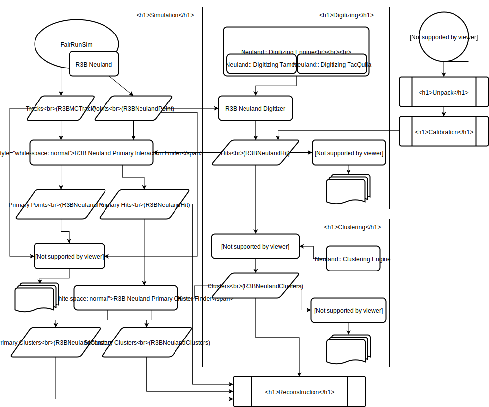

# NeuLAND module for r3broot

## Overview
Code for the NeuLAND Detector is split into different components:

- [simulation](simulation/readme.md)
- [digitizing](digitizing/readme.md)
- clustering
- [reconstruction](reconstruction/readme.md)
- test
- unpack
- shared
- neulandData (in `../r3bdata/neulandData`).

Note that in contrast to the old NeuLAND and LAND code in the /land/ directory, the spelling in e.g. class names is "Neuland", with a small "l".

The components fill storage containers for each event, which flow into other components:



### Tasks

These tasks are derived from FairTask and used in the steering macros.
Task ending on a process usually apply a transformation to data, and take the input and output branch names as attributes, e.g.:

- [`R3BNeulandDigitizer`](#digitizing): Detector response, NeulandPoints -> NeulandHits
- [`R3BNeulandClusterFinder`](#clustering): Clustering of digitized data, NeulandHits -> NeulandClusters

Task ending on `mon` create control histograms, and might be quite messy. They take the input branch and output folder names as arguments. Examples:

- `R3BNeulandMCMon`: Control histograms for MonteCarlo data (NeulandPoints)
- `R3BNeulandHitMon`: Control histograms for digitized data (NeulandHits)
- `R3BNeulandClusterMon`: ControlHistograms for clusters (NeulandClusters)


### Data Storage

Note that the classes indented for storing data (derived from TObject for usage with TClonesArray) are located in `r3bdata/neulandData`.

- `R3BNeulandPoint`: Basic MonteCarlo energy depositions and light yield, see, [Detector Class](#detector-class)
- `R3BNeulandHit`: Combined NeulandPoints, digitized with detector response, see [Digitizing](#digitizing). Also indented for mapped and calibrated experimental data.
- `R3BNeulandCluster`: Clusters consisting out of NeulandHits that belong together according to clustering conditions, see [Clustering](#clustering)
- `R3BNeulandNeutron`: Position, Energy and Time information for neutron interactions found by event reconstruction processes


### Configuration Storage

- `R3BNeulandGeoPar`: The complete NeuLAND GeoNode used in the Simulation
- `R3BNeulandMultiplicityCalorimetricPar`: Cuts used for the [2D Method](#the-2d-method-for-neutron-multiplicity-determination) to determine neutron multiplicities.


### Auxiliary Classes

- `R3BNeulandContFact`: Container Factory for the configuration storage classes (pure boilerplate)
- `R3BNeulandVisualizer`: 3D display of events, prepared by the `-Mon` tasks. (Work in progress)
- [`Neuland::Neutron2DCalibr`](#calibration): Calibration of cuts for the 2D neutron multiplicity method


## Digitizing

The Digitizing task `R3BNeulandDigitizer` handles the Input and Output of data while invoking the `Neuland::DigitizingEngine` for the actual processing.

See [digitizing/](digitizing/readme.md) for more details.


## Clustering

Clustering is the process of grouping Objects together by a specified condition.

The task `R3BNeulandClusterFinder` uses the  implementation in `Neuland::ClusteringEngine` of what can be called *handshake-chain clustering*, where a cluster is finished if all of the Digis in it have no neighbor that is not in the cluster.

The task takes the TClonesArray NeulandHits(`R3BNeulandHit`) and fills TClonesArray NeulandClusters(`R3BNeulandCluster`).

Control histograms are located  to `R3BNeulandClusterMon`.


### Implementation of the handshake-chain clustering

The implementation is a template, thus any type of object can be clustered together.
For this example, integers are used. Starting point is an unsorted vector of integers and the clustering condition is a difference of 1 or less. For the clustering process, several iterators referencing certain points in the vector are needed:

- The *begin* of the current part of the vector to look at
- A *moving_divider* that separates the clustered part from the rest of the unclustered part
- The fixed *end* of the vector
- And the iterator to the object currently looked at, here called *a*

```C++
Tit moving_partition(const Tit begin, Tit moving_divider, const Tit end) const
{
	for (Tit a = begin; a != moving_divider; a++)
	{
		moving_divider = std::partition(moving_divider, end, [&](const T& b) {return f(*a, b);});
	}
    return moving_divider;
}
```

In the beginning, the vector is completely unclustered and a new cluster is started with the first element:

	{ 28, 13, 23, 22, 15, 16, 3, 6, 4, 26, 10, 11, 19, 8, 29, 12, 25, 30, 17, 18, 24 }
	   │   │                                                                         │
	   │   └ moving_divider                                                          └ end
	   └ begin, a

Now, each object from the moving_divider to the end is compared with *a*, which currently is the first element, and if the clustering condition is fulfilled, moved next to it. This is done by std::partition. Now the *moving_divider* is set to the end of this partitioned part, and the next element between the current *a* and the *moving_divider* becomes the new *a*, which the unclustered part is compared to:

	{ 28, 29, 30, 22, 15, 16, 3, 6, 4, 26, 10, 11, 19, 8, 23, 12, 25, 13, 17, 18, 24 }
	   │   │       │                                                                 │
	   │   a       └ moving_divider                                                  └ end
	   └ begin

This continues until the *moving_divider* is reached, at this point the cluster is finished and extracted, and a new cluster is started:

	{ xx, xx, xx, 22, 15, 16, 3, 6, 4, 26, 10, 11, 19, 8, 23, 12, 25, 13, 17, 18, 24 }
	               │   │                                                             │
	               │   └ moving_divider                                              └ end
	               └ begin, a

Note that the *moving_divider* does move every time std::partition adds new objects to the cluster, thus also these times are iterated over:


	{ xx, xx, xx, 22, 23, 16, 3, 6, 4, 26, 10, 11, 19, 8, 15, 12, 25, 13, 17, 18, 24 }
	               │   │   │                                                         │
	               │   a   └ moving_divider                                          └ end
	               └ begin
	{ xx, xx, xx, 22, 23, 24, 3, 6, 4, 26, 10, 11, 19, 8, 15, 12, 25, 13, 17, 18, 16 }
	               │       │  │                                                      │
	               │       a  └ moving_divider                                       └ end
	               └ begin
	{ xx, xx, xx, 22, 23, 24, 25, 6, 4, 26, 10, 11, 19, 8, 15, 12, 3, 13, 17, 18, 16 }
	               │           │  │                                                  │
	               │           a  └ moving_divider                                   └ end
	               └ begin

Note that for this process, the order of the objects is irrelevant. The algorithm will always find all elements that belong together.

In this example, the result is:

	{ 28, 29, 30 }, { 22, 23, 24, 25, 26 }, { 4, 3 }, { 10, 11, 12, 13 }, { 8 }, { 19, 18, 17, 16, 15 }, { 6 }

