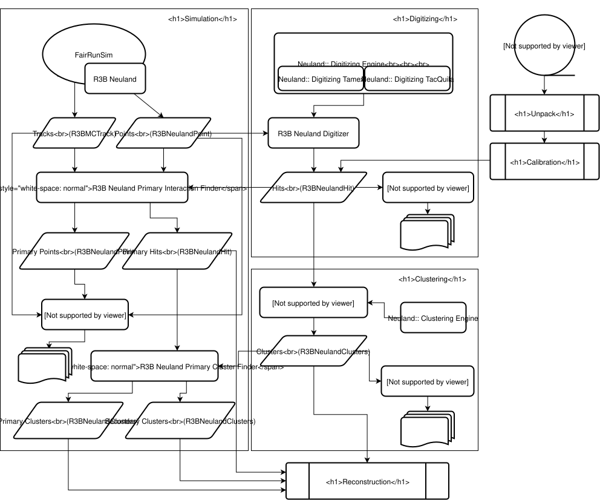

# NeuLAND module {#neuland}

Code for the NeuLAND Detector is split into different components:

- \subpage neuland_overview "Overview"
- \subpage neuland_cal "Calibration"
- \subpage neuland_sim "Simulation"
- \subpage neuland_digitizing "Digitization"
- \subpage neuland_cluster "Clustering"
- \subpage neuland_recon "Reconstruction"
- test
- unpack
- shared
- \subpage neuland_exe "Command line interface"
- neulandData (in `../r3bdata/neulandData`)
- \subpage neuland_online "Online analysis"

Other related documentations:

- \subpage neuland_container "Running programs in containers"
- \subpage NEULANDHPC
- \subpage neuland_style

Note that in contrast to the old NeuLAND and LAND code in the /land/ directory, the spelling in e.g. class names is "Neuland", with a small "l".

The components fill storage containers for each event, which flow into other components:

